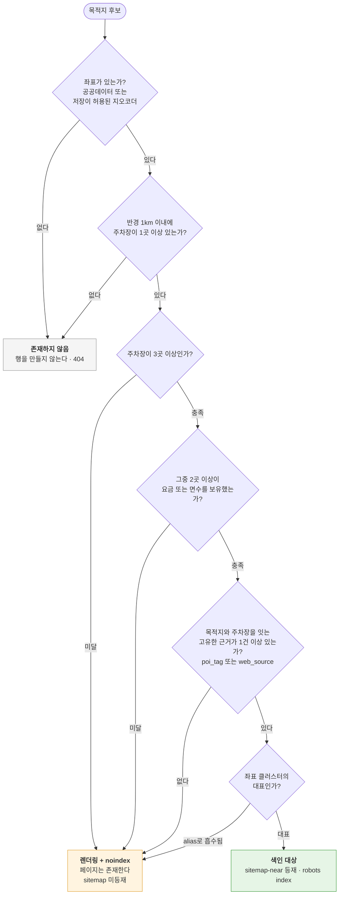
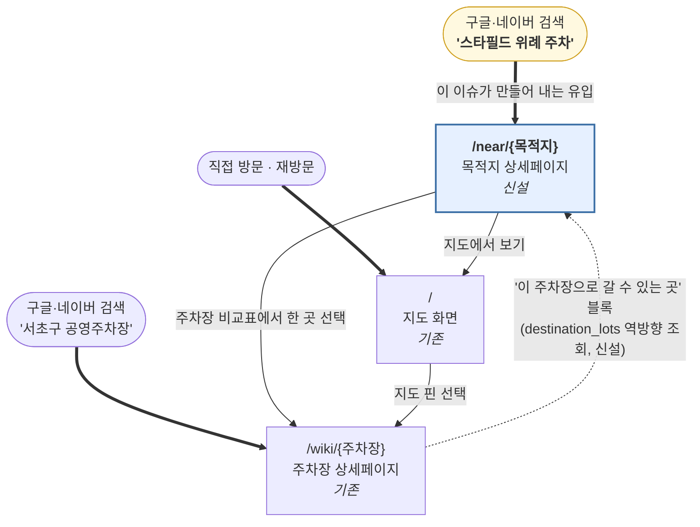
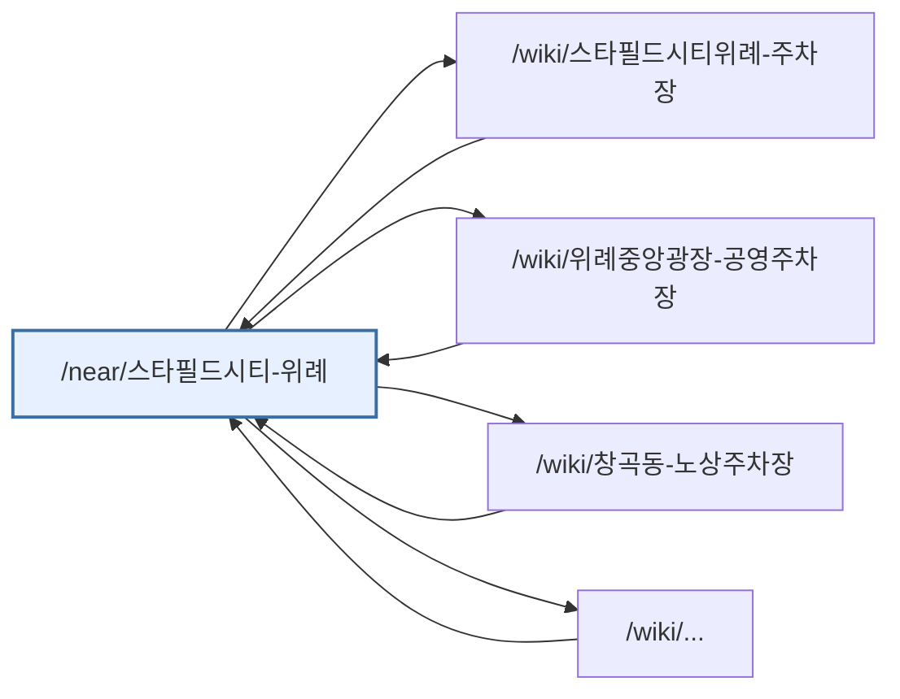

# #166 목적지(POI) 축 페이지 기획과 설계

- **작성일**: 2026-09-03
- **대상 이슈**: [#166 [SEO/구조] 목적지(POI) 축 상세페이지 신설](https://github.com/acee90/easy-parking-zone/issues/166)
- **인접 이슈**: #164(검색 축), #165(유입 검색어), #161(GSC 색인)
- **선행 문서**: [own-content-strategy.md](./own-content-strategy.md), [pipeline-architecture.md 8.3절](../references/pipeline-architecture.md), [competitors.md](../references/competitors.md)
- **상태**: **구글 축은 대기, 네이버 축은 조건부 진행.** 9-1절의 Gate-0가 채널별로 나뉘어 있습니다. 구글 쪽은 #161(sitemap-index 콜드 응답)이 풀릴 때까지 대기하고, 네이버 쪽은 서치어드바이저 등록 확인과 유입 검색어 확보(#165)가 착수 조건입니다.
- **검토 반영**: 2026-09-03 [issue-166-destination-pages.review.md](./issue-166-destination-pages.review.md)의 5장 수정 목록을 이 문서에 반영했습니다. 검토가 밝힌 핵심은 두 가지입니다. 유입의 99.5%가 네이버인데 문서가 구글 기준으로 쓰여 있었다는 것, 그리고 네이버 검색 "석촌역 근처 주차장"에서 이 문서가 설계한 것과 같은 `/near/{역}` 페이지가 1위와 3위에 있고 우리는 결과에 없다는 것입니다.

### 이 문서가 수치를 표기하는 규칙

`own-content-strategy.md`가 사용하는 규칙을 그대로 따릅니다. 같은 항목인데도 문서마다 값이 다른 경우가 있었기 때문에, 각 숫자가 어디에서 나왔는지를 표기해 두었습니다.

| 출처 | 표기 방법 |
|---|---|
| remote D1에서 직접 측정한 값 (2026-09-03, `wrangler d1 execute --remote`) | 아무 표기도 붙이지 않으며, 이것이 기본값입니다 |
| 소스 코드를 직접 열어서 확인한 값 | `[코드]`를 붙입니다 |
| 외부 문서나 약관을 인용한 값 | `[외부]`를 붙입니다 |
| 라이브 사이트에서 직접 조작해 확인한 값 (2026-09-03, easy-parking.xyz) | `[라이브]`를 붙입니다 |
| 네이버 검색 결과와 경쟁 페이지 원문을 수집해 읽은 값 (2026-09-03, firecrawl) | `[SERP]`를 붙입니다 |
| 근거가 없는 값 | **미확인**이라고 분명하게 적습니다 |

---

## 1. 문제를 다시 정의합니다

이슈 본문이 내린 진단은 그대로 유효합니다. 사용자는 "스타필드 위례 주차"라고 검색하는데 우리 페이지는 주차장 이름을 축으로 삼고 있으므로, 검색어와 페이지가 한 단계 어긋나 있습니다.

다만 작업에 들어가기 전에 한 가지를 먼저 분리해야 합니다. **"목적지 기반 검색"이라는 표현은 서로 다른 두 가지 문제를 함께 가리키고 있으며, 그중 하나는 이미 해결되어 있습니다.**

### 1-1. 이미 동작하고 있는 것: 사이트 안에서 이루어지는 목적지 검색

우리 사이트에 접속한 사용자가 검색창에 "석촌역"을 입력하면 지도는 이미 그 위치로 이동합니다. `searchPlaces` 서버 함수가 카카오 로컬 API의 키워드 검색을 실시간으로 호출하고 있기 때문입니다 `[코드]` (`src/server/parking.ts:826-858`). `SearchBar.tsx`는 그 결과를 받아서 "주변 주차장 찾기"와 "주차장 바로가기" 두 단으로 나누어 보여줍니다.

**라이브 사이트에서 직접 확인했습니다** `[라이브]`. "석촌역"을 입력하면 자동완성에 "석촌역 8호선", "석촌역 9호선", "석촌고분역 9호선", "올리브영 석촌역점"이 뜨고 하단에 "장소 4건 · 주차장 2건"이 표시됩니다. 그중 하나를 선택하면 지도가 석촌역으로 이동하고, 왼쪽 주차장 목록도 "석촌역 2구역 공영주차장 92m", "석촌역노상공영주차장 128m"처럼 거리순으로 갱신됩니다. **목적지 좌표를 API로 받아서 지도를 이동시키는 흐름은 완성되어 있습니다.**

### 1-2. 그런데 실제 검색어에서는 결과가 0건으로 나옵니다

같은 화면에서 **"석촌역 근처 주차장"**을 입력하면 자동완성에 **"검색 결과가 없습니다"**가 뜹니다 `[라이브]`. 사람들이 실제로 입력하는 형태가 이쪽인데, 그 형태에서 결과가 하나도 나오지 않습니다.

두 검색 경로가 같은 이유로 동시에 실패합니다.

| 경로 | 코드 | 실패하는 이유 |
|---|---|---|
| 우리 DB 주차장 검색 | `searchParkingLots` `[코드]` `parking.ts:154-163` | 입력을 공백으로 쪼갠 뒤 **모든 단어를 AND로 묶습니다.** 따라서 `석촌역` AND `근처` AND `주차장`이 전부 이름이나 주소, `poi_tags`에 들어 있어야 합니다. "근처"라는 단어를 이름에 담은 주차장은 없으므로 0건이 됩니다 |
| 카카오 장소 검색 | `searchPlaces` `[코드]` `parking.ts:849` | 응답에서 `category_group_name`이 `'주차장'`인 항목을 **전부 제외합니다.** "석촌역 근처 주차장"으로 검색하면 카카오는 주차장을 돌려주는데, 그 결과가 이 필터에 전부 걸려서 0건이 됩니다 |

두 경로가 모두 빈 배열을 반환하므로 자동완성이 "검색 결과가 없습니다"를 표시합니다. **기능이 없는 것이 아니라, 사람들이 쓰는 어투에서만 결과가 사라지는 상태입니다.**

이 결함은 이슈 #164가 다루는 검색 축에 속하며, 이 문서가 설계하는 페이지 축과는 별개입니다. 다만 두 축이 같은 검색어를 대상으로 하므로 **#164를 먼저 고치는 편이 순서상 맞습니다.** 검색창에서조차 "석촌역 근처 주차장"이 안 되는 상태로 목적지 페이지만 만들면, 검색 엔진에서 들어온 사용자가 사이트 안에서 같은 검색을 시도했을 때 다시 막히기 때문입니다.

고쳐야 할 방향은 두 가지입니다. 첫째, 검색어에서 "근처", "주변", "주차장", "주차" 같은 접미 표현을 떼어 내고 핵심 키워드만 남기는 정규화가 필요합니다. 둘째, 카카오 결과에서 주차장 카테고리를 무조건 제외하는 필터를 재검토해야 합니다. 이 필터의 원래 의도는 우리 DB 주차장과 결과가 겹치는 것을 막으려는 것이었겠지만, 부작용이 더 큽니다.

### 1-3. 존재하지 않는 것: 검색 엔진에 노출되는 목적지 페이지

문제는 사용자가 우리 사이트에 오기 전 단계에 있습니다. 구글이나 네이버에서 "스타필드 위례 주차"를 검색했을 때 우리가 내보일 수 있는 페이지가 없습니다. 사용자가 우리 사이트를 이미 알고 있어야만 목적지 검색을 쓸 수 있는 구조이므로, 신규 유입에는 기여하지 못합니다.

**유입이 늘어나는 지점은 두 번째 문제를 푸는 쪽에 있습니다.** 이슈 #166이 스스로를 "검색 축"이 아니라 "페이지 축"이라고 규정한 이유가 여기에 있습니다.

### 1-4. 두 이슈의 관계

두 이슈는 서로 다른 산출물을 만들지만, 밑에 깔리는 데이터는 하나입니다.

| 구분 | #164 (검색 축) | #166 (페이지 축) |
|---|---|---|
| 사용자가 있는 위치 | 우리 사이트 안의 검색창 | 구글과 네이버의 검색 결과 화면 |
| 만들어야 하는 산출물 | 지도 이동과 주변 주차장 목록 | 검색 엔진에 색인되는 URL 한 장 |
| 현재 상태 | 최소 형태로 동작하고 있습니다 | 존재하지 않습니다 |

두 이슈는 `destinations`라는 테이블 하나를 공유 자산으로 사용하게 됩니다. #164는 그 테이블을 자동완성 사전으로 읽고, #166은 페이지를 만드는 원본 데이터로 읽습니다. 이 문서는 그 테이블이 어떤 모양이어야 하는지를 정의합니다.

---

## 2. 첫 번째 결정: 목적지 데이터의 원천으로 카카오를 사용할 수 없습니다

이 설계에서 가장 먼저 확정해야 할 제약 조건입니다. 다른 모든 결정이 여기에 영향을 받습니다.

### 2-1. 카카오 로컬 API의 약관 내용

카카오 로컬 API의 이용약관은 응답으로 받은 결과를 별도로 저장하는 행위를 허용하지 않으며, 실시간으로 호출해서 사용하는 방식만 허용합니다. 장소 ID와 `place_url`, 그리고 사용자가 직접 입력하고 확정한 장소명 텍스트는 예외적으로 저장할 수 있지만, **좌표와 주소, 전화번호, 카테고리는 저장이 금지되어 있습니다** `[외부]`. 근거가 되는 카카오 데브톡의 공식 답변은 부록 A에 정리해 두었습니다.

### 2-2. 이 제약에서 따라 나오는 세 가지 결론

**첫째, 현재의 `searchPlaces`는 문제가 없습니다.** 실시간으로 호출해서 결과를 받고, 지도를 이동시킨 뒤에 그 결과를 버리는 방식이기 때문입니다. 어디에도 저장하지 않습니다.

**둘째, `destinations` 테이블을 카카오 검색 결과로 채우는 설계는 폐기해야 합니다.** 목적지 페이지의 핵심 기능은 "그 목적지 주변에 있는 주차장 N곳"을 계산해서 보여주는 것인데, 이 계산에는 목적지의 좌표가 반드시 필요합니다. 좌표를 저장할 수 없다면 이 경로 자체가 성립하지 않습니다.

**셋째, 기존에 쌓아 둔 데이터가 이미 이 제약에 저촉되어 있습니다.** 이 부분은 추정이 아니라 확인한 사실이므로 아래에서 따로 설명하겠습니다.

### 2-3. 기존 데이터의 출처를 확인한 결과

현재 저장소에는 POI 수집 스크립트가 남아 있지 않아서 처음에는 출처를 알 수 없었습니다. 그래서 git 이력에서 삭제된 파일을 복원해 직접 확인했습니다 `[코드]`.

**`poi_tags`와 `poi_unmatched`는 카카오에서 나왔습니다.** 커밋 `b5699c4^` 시점의 `scripts/collect-poi-pilot.ts:157`이 `dapi.kakao.com/v2/local/search/keyword.json`을 호출해서 POI를 수집했습니다. 따라서 `parking_lots.poi_tags`에 들어 있는 219개의 목적지 이름과, `poi_unmatched` 271행이 가지고 있는 `poi_lat` 및 `poi_lng` 좌표는 전부 카카오에서 받아 온 값입니다.

**노출 범위는 그보다 훨씬 넓습니다.** 같은 시점의 `scripts/load-poi-to-db.ts:325-337`은 카카오 검색 결과를 이용해서 `parking_lots` 테이블에 행을 직접 INSERT했습니다. 이때 저장한 필드는 `id`, `name`, `address`, `lat`, `lng`, `phone`입니다. 현재 `id LIKE 'KA-%'` 조건에 해당하는 주차장은 **19,323행이며, 전체 31,994행의 60.4%를 차지합니다.**

### 2-4. 이 문서가 여기에 대해 내리는 결정

**이것은 #166이 만들어 낸 문제가 아니라 이미 존재하고 있던 노출입니다.** 따라서 이 문서의 범위 안에서 내릴 수 있는 결정은 하나뿐입니다.

**#166은 이 노출을 확대하지 않습니다.** 새로 만드는 `destinations` 테이블은 카카오에서 채우지 않으며, 기존에 확보되어 있는 119건의 카카오 좌표도 승계하지 않습니다.

이미 적재되어 있는 19,323개의 `KA-` 행을 어떻게 처리할 것인지는 이 문서가 결정할 수 있는 범위를 넘어섭니다. 별도의 판단이 필요하며, 10장 위험 등록부의 R-1 항목에 올려 두었습니다.

### 2-5. 그렇다면 목적지 데이터는 어디에서 가져오는가

저장이 허용되는 원천은 두 갈래입니다.

**첫 번째는 공공데이터포털의 표준데이터입니다.** 전통시장, 대규모 및 준대규모 점포, 관광지, 문화시설, 지하철역 등의 데이터셋이 여기에 해당합니다. 우리는 이미 주차장 데이터를 같은 경로로 받아 오고 있으므로(`scripts/sync-public-data.ts`), 파이프라인을 새로 만들 필요는 없습니다. 대부분의 데이터셋이 위도와 경도를 함께 제공합니다. 다만 대규모점포 데이터는 좌표계가 EPSG:5174(보정계수가 들어가지 않은 Bessel 중부원점TM)이므로 변환 작업이 필요합니다 `[외부]`.

**두 번째는 우리가 이미 보유하고 있는 `web_sources`의 제목입니다.** 블로거가 실제로 사용한 목적지 이름이 제목에 그대로 드러나기 때문입니다. `naver_blog`와 `naver_cafe`로 한정하고, 제목에 "주차"가 포함되며 `relevance_score`가 40 이상인 행은 **5,534행**입니다. 무작위로 표본을 뽑아 보면 "전주 한옥마을", "거제 바람의언덕", "스타필드시티위례", "하이디라오 부산역점", "파주 운정역"처럼 목적지 이름을 그대로 읽어 낼 수 있는 제목이 나옵니다.

여기에서 한 가지 주의할 점이 있습니다. 같은 조건에서 `source` 제한을 풀면 대상이 16,239행으로 늘어나지만, 늘어난 1만여 건은 대부분 경쟁사 애그리게이터의 제목입니다. "일상킷", "주차장모아", "플레이스뷰"가 그런 경우이고, 우리 자신의 페이지인 "쉬운주차장"도 섞여 있습니다. 따라서 제목 마이닝은 반드시 블로그와 카페로 한정해야 합니다.

---

## 3. 두 번째 결정: 목적지의 종류를 둘로 나누고, 1차 범위는 대형시설로 한정합니다

### 3-1. 두 가지 목적지 종류

경쟁사가 만들고 있는 목적지 페이지를 살펴보면 성격이 다른 두 종류가 섞여 있습니다.

**대형시설 축**은 스타필드 위례, 경동시장, 롯데백화점 노원점처럼 규모가 큰 시설을 가리킵니다. 우리는 이미 `poi_tags`를 통해 목적지 219개와 주차장 1,063곳 사이의 연결 근거 1,947건을 보유하고 있습니다. 이런 시설은 대체로 도심에 있으므로 주변 주차장이 여러 곳 존재하며, 따라서 페이지 한 장에 담을 내용이 자연스럽게 확보됩니다.

**사업장 축**은 경쟁사가 만든 "바탕성형외과의원 주차 정보 안내" 같은 페이지를 가리킵니다. 개별 병원이나 상점 단위입니다. 우리에게는 이런 사업장에 대한 데이터가 전혀 없습니다. 게다가 사업장 한 곳 주변에는 주차장이 한두 곳밖에 없는 경우가 많으므로, 페이지를 만들어도 내용이 부족한 상태가 되기 쉽습니다.

### 3-2. 1차 범위를 대형시설로 한정하는 이유

**1차 범위는 대형시설 축으로만 진행합니다.** 사업장 축은 새로운 수집 파이프라인(건강보험심사평가원의 병원정보 서비스 등)을 만들어야 하는 별도의 프로젝트인 데다가, 내용이 부족한 페이지가 대량으로 생길 위험이 가장 큽니다.

사업장 축은 다음 두 조건을 모두 만족할 때에만 다시 검토합니다. 첫째, 대형시설 축으로 만든 페이지 중에서 GSC 기준으로 색인이 생성된 비율이 60% 이상이어야 합니다. 둘째, 목적지 페이지로 들어오는 유입이 주차장 상세페이지 유입의 10% 이상이어야 합니다. 이 조건에 미달한다면 사업장 축은 내용이 부족한 페이지의 개수만 늘리는 결과로 이어집니다.

### 3-3. 경쟁사의 6,170장을 목표로 삼지 않는 이유

경쟁사는 목적지 페이지를 6,170장 발행하고 있지만, 이 숫자를 따라가는 것은 목표가 아닙니다.

그중 상당수가 같은 건물 안에 입점한 개별 매장을 각각 한 장씩 페이지로 만든 것이기 때문입니다. "크록스 스타필드 시티 명지점"이 그런 사례이며, 같은 건물에 있는 매장들이 서로에게 `0m 거리`라고 표기된 상태로 연결되어 있습니다. 내부 링크 개수를 늘리기 위해서 중복 콘텐츠를 스스로 만들어 낸 구조입니다.

우리는 6장에서 반대 방향으로 설계합니다. 같은 건물에 속하는 목적지들을 하나로 묶고, 대표 한 곳만 페이지로 만듭니다.

**벤치마크 대상은 loveash가 아닙니다.** 검토(review.md 2-1절)에서 네이버 통합검색 "석촌역 근처 주차장"의 웹사이트 결과를 수집한 결과, loveash는 9위였고 그것도 `/info/` 목적지 페이지가 아니라 `/parking/10237` 주차장 페이지였습니다. 6,170장의 `/info/`는 한 장도 나타나지 않았습니다. 대신 **1위 `hazelfy.com/parking/near/seokchon/`과 3위 `parking.mustarddata.com/near/seokchon-station/`이 이 문서가 설계한 것과 같은 `/near/{역}` 목록 페이지**였습니다. 목적지 축이 효과가 있다는 결론은 유지되지만, 그 근거와 벤치마크는 이 두 곳입니다.

### 3-4. 지금 만들 수 있는 페이지 수를 실제로 측정한 결과

`poi_tags`만으로 당장 만들 수 있는 목적지 페이지가 몇 장인지 측정했습니다.

| 조건 | 통과한 목적지 수 |
|---|---:|
| `poi_tags`에 들어 있는 전체 목적지 | 219 |
| 연결된 주차장이 3곳 이상 | 193 |
| 연결된 주차장이 3곳 이상이면서, 그중 2곳 이상이 요금 또는 면수 정보를 보유 | **193** |
| `relevance_score`가 40 이상인 web_source를 가진 주차장을 1곳 이상 포함하고, 연결 주차장이 2곳 이상 | 180 |
| 좌표를 이미 보유 (`poi_unmatched`와 조인) | 119 / 219 (다만 **전량 카카오 유래이므로 사용할 수 없습니다**) |

이 표를 읽을 때 두 가지를 함께 고려해야 합니다.

**첫째, 위의 193은 `poi_tags`의 링크 수를 기준으로 계산한 값입니다.** 정확히는 `COUNT(DISTINCT lot) >= 3` 조건으로 계산했습니다. 그런데 5장에서 정의하는 색인 조건 2번은 "반경 1km 이내"를 기준으로 삼기 때문에, 두 값은 엄밀하게 같지 않습니다. 대형시설은 태그가 붙은 주차장이 대체로 반경 안에 들어오므로 실제로는 비슷하게 나오겠지만, **193은 반경 기준 게이트의 대리값이며 좌표를 확보한 뒤에 다시 계산해야 합니다.**

**둘째, 좌표 219건을 전부 새로 확보해야 합니다.** 기존에 있던 119건은 카카오에서 나온 값이므로 승계할 수 없기 때문입니다. 따라서 193은 상한선이며, 착수 시점에 실제로 발행할 수 있는 페이지 수는 이보다 적습니다. 공공데이터와 얼마나 매칭되느냐에 따라 결정됩니다.

**Tier 0의 상한은 193장입니다.** 이 숫자를 정면으로 볼 필요가 있습니다. 193장으로는 유입이 의미 있게 늘어나지 않습니다. Tier 0는 이 접근 방식이 성립하는지를 확인하는 파일럿이며, 실제 유입은 4장에서 설명하는 Tier 1과 Tier 2에서 나옵니다.

참고로 `poi_tags` 목적지 하나에 연결된 주차장의 개수 분포는 다음과 같습니다. 10곳 이상이 82개, 5곳에서 9곳 사이가 76개, 3곳에서 4곳 사이가 35개, 2곳이 19개, 1곳이 7개입니다. 상위 구간이 두껍기 때문에 **"목적지 한 장에 주차장 N곳의 비교표를 담는다"는 페이지 형태 자체는 성립합니다.**

---

## 4. 목적지 데이터를 네 단계로 나누어 확장합니다

| 단계 | 데이터 원천 | 규모 | 좌표 확보 상태 | 위치 |
|---|---|---:|---|---|
| **Tier 0** | `poi_tags` 219개 (이름 자체도 카카오 유래입니다) | 링크 기준 **193** (상한) | 219건 전부 재취득이 필요합니다 | 파일럿 |
| **Tier 1** | 공공데이터포털 표준데이터 (전통시장, 대규모점포, 관광지, 문화시설, 지하철역) | **미확인. 부록 B의 절차로 측정한 뒤에 확정합니다** | 데이터셋이 자체적으로 제공합니다 | 확장 |
| **Tier 2** | `web_sources` 블로그 제목 5,534행에서 목적지 이름을 추출 | 미확인 | 없으므로 지오코딩이 필요합니다 | 수요 기반 보강 |
| **Tier 3** | 사업장 단위 (병원과 의원 등) | 대규모 | 별도 파이프라인이 필요합니다 | **보류** |

### 4-0. Tier 1 안에서는 지하철역이 최우선입니다

Tier 1의 카테고리 중에서 어느 것을 먼저 적재할지는 검색어의 형태가 결정합니다. 관찰된 검색 패턴은 **"석촌역 근처 주차장"**처럼 역 이름을 기준으로 삼는 형태입니다. 역은 목적지 그 자체이기보다 **약속 장소를 지칭하는 좌표 표현**에 가깝기 때문에, 백화점이나 시장보다 훨씬 넓은 범위의 방문 목적을 한 이름으로 흡수합니다.

역이 목적지로서 유리한 조건을 갖춘 이유는 다음과 같습니다.

- 이름이 **고유하고 표기 변형이 적습니다.** "석촌역"은 띄어쓰기 변형이 거의 없고, 같은 이름의 역이 전국에 하나뿐인 경우가 대부분입니다. 백화점의 "롯데백화점 노원점"처럼 지점명을 붙여야 구분되는 문제가 없습니다.
- **도심에 있으므로 반경 안의 주차장이 충분합니다.** 5장의 색인 조건 2번과 3번을 통과할 가능성이 높습니다.
- 데이터셋의 규모가 크지 않아 **1차 적재의 분량이 통제 가능합니다.**
- 우리 검색창 실측에서 이미 확인되었듯이, 역 이름은 카카오 결과와 우리 DB 주차장이 **둘 다 잘 잡히는 키워드입니다** `[라이브]`.

따라서 Tier 1의 적재 순서는 **지하철역 → 전통시장 → 대규모점포 → 관광지** 순으로 잡습니다. 다만 이 순서는 이슈 #165의 유입 검색어가 확보되면 실제 수요 데이터로 다시 검증해야 합니다.

### 4-1. Tier 1을 진행할 때 주의할 점

우리는 주차장을 31,994곳 보유하고 있습니다. 그래서 도심에 있는 목적지라면 "반경 500m 이내에 주차장 3곳"이라는 조건을 거의 자동으로 통과합니다. 즉 **주차장 개수는 실질적인 게이트로 기능하지 못합니다.** 페이지를 발행할지 판단하는 기준은 5장에서 따로 설계합니다.

### 4-2. 실제로는 Tier 2가 가장 중요합니다

Tier 1은 "우리가 데이터를 가지고 있는 목적지"의 목록입니다. 반면 Tier 2는 "사람들이 실제로 '○○ 주차'라고 검색한 목적지"의 목록입니다. 유입을 늘리는 것이 목적이라면 후자가 훨씬 직접적입니다.

이슈 #165가 다루는 네이버 유입 검색어와 GSC의 검색어 리포트가 확보되면, Tier 2는 **수요가 많은 순서로 정렬된 목적지 목록**이 됩니다. 따라서 페이지를 발행하는 우선순위는 Tier 1의 데이터 규모가 아니라 Tier 2의 수요 순서를 따라야 합니다.

---

## 5. 세 번째 결정: 발행과 색인을 판정하는 게이트를 둡니다

이 이슈에서 가장 큰 위험이 여기에 있습니다.

### 5-1. 왜 게이트가 필요한가

이슈 본문이 스스로 지적한 위험이 정확합니다. "목적지 페이지가 얇으면 지금 겪고 있는 색인 문제를 더 키운다"는 지적입니다.

현재 sitemap에 등재된 페이지 중에서 **41.6%에 해당하는 7,500장이 이미 내용이 부족한 상태입니다.** 웹소스도 없고 AI 요약도 없으며 `curation_reason`도 없이, 기본 필드 세 개만 채워져 있다는 이유로 등재된 페이지들입니다. 여기에 내용이 부족한 목적지 페이지를 더 얹으면 사이트 전체의 품질 신호를 더 떨어뜨리게 됩니다.

### 5-2. 세 가지 상태로 나눕니다

주차장 상세페이지에 이미 적용하고 있는 `shouldIndexParkingDetail` `[코드]` (`src/lib/seo-indexing.ts`)과 같은 사상을 따르되, 조건은 목적지에 맞게 새로 정의합니다.

**첫 번째 상태는 "존재하지 않음"입니다.** 좌표가 없거나 반경 1km 이내에 주차장이 한 곳도 없다면 `destinations` 테이블에 행을 만들지 않습니다. 해당 URL은 404를 반환합니다.

**두 번째 상태는 "렌더링하되 `noindex`"입니다.** 좌표가 있고 주변 주차장이 1곳 이상 있지만 아래의 색인 조건에는 미달하는 경우입니다. 페이지 자체는 존재하므로 #164의 검색 결과에서 착지할 수 있고 내부 이동에도 쓸 수 있지만, sitemap에는 등재하지 않으며 `robots` 메타 태그를 `noindex`로 내보냅니다.

**세 번째 상태는 "색인 대상"입니다.** 아래 다섯 가지 조건을 모두 만족하는 경우이며, sitemap에 등재하고 `robots`를 `index`로 내보냅니다.

### 5-3. 색인 조건 다섯 가지 (모두 만족해야 합니다)

1. 좌표를 보유하고 있어야 합니다. 그 좌표의 원천은 공공데이터이거나 우리가 저장할 수 있는 지오코더의 결과여야 하며, 카카오에서 받아 온 값이면 안 됩니다.
2. 반경 1km 이내에 주차장이 **3곳 이상** 있어야 합니다.
3. 그 주차장 중에서 **2곳 이상이 요금 정보(무료 플래그 또는 `base_fee > 0`)나 `total_spaces > 0`을 보유**해야 합니다. 비교표가 빈칸으로 가득 차면 이 페이지의 유일한 자체 가치가 사라지기 때문입니다.
4. **목적지와 주차장을 연결하는 고유한 근거가 1건 이상** 있어야 합니다. `poi_tags` 링크이거나, 그 목적지의 이름을 제목이나 본문에 담고 있으면서 `relevance_score`가 40 이상인 web_source입니다.
5. 목적지 이름이 6장에서 설명하는 좌표 클러스터의 대표여야 합니다.

### 5-4. "없는 값은 만들지 않는다" 원칙을 문자 그대로 적용합니다

`pipeline-architecture.md` 8.3절의 원칙을 그대로 가져옵니다.

**반경 안에 있는 주차장의 요금 정보가 전부 없는 경우에는 요금 열을 비교표에서 제거합니다.** "방문 전 확인을 권장합니다" 같은 문장으로 빈칸을 채우지 않습니다.

**목적지와 연결된 web_source가 한 건도 없는 경우에는 스니펫 섹션 자체를 렌더링하지 않습니다.**

**도보 시간을 표시할 때에는 직선거리를 기준으로 계산한 값이라는 사실을 화면에 밝힙니다** (`walkMinutes` `[코드]`, `src/lib/parking-fee.ts:60`). 경쟁사는 "가장 가까운 곳은 약 1m 거리"처럼 명백히 잘못된 값을 그대로 노출하고 있는데, 우리는 좌표 검증에 실패하면 거리 열을 숨기는 방식으로 이 문제를 방지합니다.

**목적지 단위의 AI 요약은 연결된 web_source가 3건 이상일 때에만 생성합니다.** 3건 미만이면 그 필드를 아예 만들지 않습니다.

경쟁사가 본문 2,163자를 만들어 내는 방법은 템플릿 문장을 반복하는 것입니다. **그 분량을 따라가려고 해서는 안 됩니다.** 우리 목적지 페이지의 분량은 "주차장 N곳이 실제로 가지고 있는 값"에서 나와야 하며, N이 작으면 페이지도 짧아야 합니다.

### 5-5. 게이트 판정 흐름

목적지 후보 하나가 세 가지 상태 중 어디로 떨어지는지를 그림으로 정리하면 다음과 같습니다.





> 위 mermaid 블록이 렌더링되지 않는 뷰어를 위해 같은 그림을 SVG로도 넣었습니다. 내용은 동일합니다.

`noindex` 상태에 머무는 목적지도 페이지 자체는 존재합니다. 사이트 안에서 검색해서 찾아갈 수 있고 내부 링크로 이동할 수도 있지만, 검색 엔진에는 노출하지 않습니다. **내용이 부족한 페이지를 검색 엔진에 내보내지 않으면서도 사이트 안에서의 사용성은 유지하기 위한 구분입니다.**

---

## 6. 네 번째 결정: URL 구조와 canonical 관계, 그리고 중복 방지

### 6-1. URL 구조

```
/near/{목적지-슬러그}-{destId}
예시: /near/스타필드시티-위례-D-1042
```

기존의 `/wiki/{name}-{lotId}`와 같은 규칙입니다. 이렇게 하면 목적지의 이름이 바뀌더라도 id로 해석할 수 있고, 이름이 같은 목적지가 여러 곳 있어도 URL이 충돌하지 않습니다.

`destId`는 우리가 발급하는 안정적인 id이며 `D-` 접두사를 붙입니다. 공공데이터의 관리번호 같은 원천 식별자는 `source`와 `source_id` 컬럼에 따로 보관합니다.

경로를 `/wiki/` 하위가 아니라 `/near/`로 분리하는 이유는 다음과 같습니다. 두 축이 같은 네임스페이스에 섞이면 sitemap을 나누기도 어렵고 robots 게이트를 따로 관리하기도 어려워집니다. 뒤에서 설명하듯이 목적지 페이지의 색인률을 독립적으로 관측하는 것이 이 프로젝트의 안전장치이므로, 경로부터 분리해 두어야 합니다.

### 6-2. 목적지 페이지와 주차장 페이지는 중복이 아닙니다

다만 중복이 되지 않으려면 조건이 있습니다.

| 구분 | `/near/{dest}` | `/wiki/{lot}` |
|---|---|---|
| 다루는 주제 | 목적지 한 곳을 기준으로 **주차장 N곳을 비교**합니다 | 주차장 한 곳을 **깊이** 다룹니다 |
| 고유한 텍스트 | 목적지 요약, 비교표, 목적지 맥락 스니펫 | 주차장 단위 AI 요약과 팁, FAQ, 리뷰, 블로그 |
| 금지 사항 | **주차장 상세페이지의 본문(주차장 단위 `ai_summary`와 블로그 스니펫 전문)을 재생산하지 않습니다** | 해당 없음 |

**두 페이지 모두 자기 자신을 canonical로 선언합니다.**

두 페이지에서 겹치는 것은 주차장 이름, 요금, 면수 같은 사실 필드뿐입니다. 사실 필드가 여러 페이지에 반복되는 것은 중복 콘텐츠 판정의 대상이 아닙니다. 문제가 되는 것은 문장을 그대로 재사용하는 경우이므로, **그것만 코드 수준에서 막으면 됩니다.**

### 6-3. 경쟁사가 겪고 있는 `0m` 문제를 좌표 클러스터링으로 방지합니다

같은 건물 안에 입점한 매장을 각각 페이지로 만들면 서로 거리가 0m인 중복 페이지 무리가 생깁니다. 우리는 데이터를 적재하는 단계에서 이것을 막습니다.

```
목적지 후보들을 근거 개수가 많은 순서로 훑습니다.
  → 이미 선정된 대표 중에서 50m 이내에 있는 것이 있으면, 그 대표의 alias로 흡수합니다.
  → 50m 이내에 아무 대표도 없으면, 새로운 대표로 선정합니다.
  → alias로 흡수된 목적지는 페이지를 만들지 않습니다.
  → 다만 #164의 자동완성에서는 그대로 검색되며, 선택하면 대표 페이지로 착지합니다.
```

고정된 격자로 나누는 방식을 쓰지 않는 이유는, 격자의 경계선을 사이에 두고 5m 떨어져 있는 두 목적지가 서로 다른 칸에 들어가 버리기 때문입니다. 위와 같이 이미 선정된 대표를 기준으로 하나씩 붙여 나가는 방식이면 그런 문제가 생기지 않습니다.

### 6-4. "페이지를 새로 만들 것인가, 기존 페이지에 섹션을 붙일 것인가"

이슈 본문이 던진 이 질문의 답은 **둘 다 한다**입니다.

**새로 만드는 것**은 `/near/{dest}` 목적지 랜딩 페이지입니다. 검색어와 제목을 일치시키는 것이 이 이슈의 목적이므로, 이 페이지가 없으면 이슈가 성립하지 않습니다.

**섹션으로 붙이는 것**은 `/wiki/{lot}`에 새로 추가하는 **"이 주차장으로 갈 수 있는 곳"** 블록입니다. `destination_lots` 테이블을 `parking_lot_id`로 역방향 조회해서, 이 주차장을 포함하는 목적지 페이지의 목록을 링크로 렌더링합니다. 예를 들어 석촌역노상공영주차장의 상세페이지에는 "석촌역 근처 주차장" 링크가 뜹니다. 목록 하나를 링크로 그리는 수준이라 작업량은 작습니다.

> **이전 판본의 오류를 바로잡습니다.** 이 문서의 이전 판본은 기존의 "여기 주차하고 가볼 곳" 카드(`NearbyPlacesSection`)에 목적지 링크를 걸겠다고 했습니다. 그 카드는 블로그에서 AI가 추출한 **카페와 맛집, 공원**(`nearby_places`)을 보여주는 것이고, 목적지 페이지의 대상은 **역과 시장, 백화점**(`destinations`)입니다. 서로 다른 데이터이므로 "카페모카" 카드에서 `/near/카페모카`로 가는 링크는 성립하지 않습니다. `NearbyPlacesSection`은 손대지 않습니다.

후자가 내부 링크의 개수를 늘려 줍니다. 경쟁사가 내부 링크를 47개나 가지고 있는 이유는 목적지와 주차장을 양방향으로 연결했기 때문이며, 그 자체로 대단한 구조는 아닙니다. **양방향으로 링크를 걸면 링크 개수는 자동으로 따라옵니다.**

---

## 7. 데이터 설계

### 7-1. `destinations` 테이블

```sql
CREATE TABLE destinations (
  id            TEXT PRIMARY KEY,          -- 'D-1042'
  name          TEXT NOT NULL,             -- 대표 표기
  slug          TEXT NOT NULL,
  category      TEXT NOT NULL,             -- market | mall | tourist | culture | station | etc
  lat           REAL NOT NULL,
  lng           REAL NOT NULL,
  address       TEXT,
  source        TEXT NOT NULL,             -- public_data:<dataset> | blog_mined
  source_id     TEXT,                      -- 원천 관리번호 (있는 경우)
  cluster_id    TEXT,                      -- 50m 클러스터 묶음
  is_primary    INTEGER NOT NULL DEFAULT 1,-- 클러스터 대표 여부
  index_state   TEXT NOT NULL DEFAULT 'none', -- none | noindex | index (5장 게이트의 결과, 배치로 계산)
  ai_summary    TEXT,                      -- 연결 소스가 3건 이상일 때에만 채웁니다
  created_at    TEXT DEFAULT (datetime('now')),
  updated_at    TEXT DEFAULT (datetime('now'))
);
CREATE INDEX idx_destinations_geo   ON destinations(lat, lng);
CREATE INDEX idx_destinations_index ON destinations(index_state);
CREATE UNIQUE INDEX idx_destinations_slug ON destinations(slug);
```

`source` 컬럼에 `kakao`가 들어가는 경우는 없습니다. 2장에서 정한 대로 카카오 결과는 적재하지 않기 때문입니다.

### 7-2. `destination_aliases` 테이블

```sql
CREATE TABLE destination_aliases (
  id             INTEGER PRIMARY KEY AUTOINCREMENT,
  destination_id TEXT NOT NULL REFERENCES destinations(id),
  alias          TEXT NOT NULL,   -- '스타필드위례', '위례 스타필드', '스타필드 시티 위례'
  kind           TEXT NOT NULL,   -- spacing | abbrev | tenant | search_term
  UNIQUE(destination_id, alias)
);
```

`kind`가 `search_term`인 행이 이슈 #165에서 수집하는 유입 검색어가 착지하는 지점입니다. 띄어쓰기 변형에 해당하는 `spacing`은 생성 규칙으로 자동으로 만들어 냅니다.

### 7-3. `destination_lots` 테이블 (사전 계산)

거리 계산을 요청이 들어올 때마다 수행하지 않습니다. `parking_lot_stats`와 동일하게 미리 계산해 두는 방식을 따릅니다.

```sql
CREATE TABLE destination_lots (
  destination_id TEXT NOT NULL REFERENCES destinations(id),
  parking_lot_id TEXT NOT NULL REFERENCES parking_lots(id),
  distance_m     INTEGER NOT NULL,
  walk_minutes   INTEGER NOT NULL,
  evidence       TEXT,   -- 'poi_tag' | 'web_source:<id>' | null (근접 관계만 아는 경우)
  rank           INTEGER NOT NULL,
  PRIMARY KEY (destination_id, parking_lot_id)
);
```

`evidence` 컬럼이 5장의 색인 조건 4번을 판정하는 근거가 됩니다. 연결된 행이 전부 `null`인 목적지는 "가깝다는 사실만 알고 있는 곳"이므로 `noindex` 상태로 떨어집니다.

### 7-4. 사용하지 않기로 한 것

**`nearby_places` 테이블을 목적지 원천으로 재사용하지 않습니다.** 전체가 56행이고 주차장 46곳에만 연결되어 있어 규모가 너무 작습니다. 방향도 반대여서 주차장에서 주변 장소를 향하는 구조이고, 좌표도 없습니다. 목적지 이름의 후보를 참고하는 용도로만 씁니다.

---

## 8. 화면 구성과 사용자 흐름

### 8-1. 페이지 종류가 두 가지에서 세 가지로 늘어납니다

지금 우리 사이트에는 사용자가 도달하는 페이지가 두 종류 있습니다.

| 경로 | 성격 | 색인 대상 |
|---|---|---|
| `/` | 지도 화면입니다. 사용자가 지도를 움직이며 탐색합니다 | 아닙니다 |
| `/wiki/{주차장}` | 주차장 상세페이지입니다 | 맞습니다 |

여기에 한 종류가 추가됩니다.

| 경로 | 성격 | 색인 대상 |
|---|---|---|
| `/near/{목적지}` | 목적지 상세페이지입니다. 목적지 한 곳을 기준으로 주변 주차장을 비교합니다 | 맞습니다 |

세 페이지는 서로 다른 질문에 답합니다. 지도는 "이 근처에 무엇이 있는가"에 답하고, 주차장 상세페이지는 "이 주차장은 어떤 곳인가"에 답하며, 목적지 페이지는 **"여기에 가려고 하는데 어디에 주차해야 하는가"**에 답합니다. 세 번째 질문이 사람들이 검색창에 실제로 입력하는 질문이며, 지금 우리에게는 그 답을 담은 페이지가 없습니다.

### 8-2. 사용자가 사이트에 도달하는 경로와 그 이후의 이동

> **읽기 쉬운 판본**: 아래 mermaid 그림은 순환 구조라 화살표가 얽혀 읽기 어렵습니다. 같은 내용을 IA 트리 한 장과 시나리오 세 줄로 다시 그린 아티팩트가 있습니다. https://claude.ai/code/artifact/4b8fca3f-2961-474a-a141-3036a09b5635 (비공개, 공유는 페이지의 공유 메뉴에서)





> 위 mermaid 블록이 렌더링되지 않는 뷰어를 위해 같은 그림을 SVG로도 넣었습니다. 내용은 동일합니다.

굵은 화살표 세 개가 사이트 바깥에서 들어오는 진입점입니다. **`/near`로 들어오는 화살표가 이 이슈가 새로 만들어 내는 유입 경로입니다.**

점선 화살표는 기존 화면에서 유일하게 바뀌는 부분입니다. 주차장 상세페이지에 "이 주차장으로 갈 수 있는 곳" 블록이 추가되어 목적지 페이지로 가는 링크가 생깁니다(6-4절).

**사이트 안의 검색창은 이 그림에 등장하지 않습니다.** 이미 동작하고 있어서 바뀌지 않기 때문입니다. 지도 화면에서 "스타필드 위례"를 입력하면 지금도 지도가 그 위치로 이동합니다(1-1절).

### 8-3. 양방향 링크가 내부 링크 개수를 만들어 냅니다

경쟁사가 내부 링크를 47개나 가지고 있는 이유는 특별한 구조 때문이 아니라, 목적지와 주차장을 양쪽 방향으로 연결했기 때문입니다. 목적지 한 곳에 주차장 여덟 곳이 걸리고, 그 주차장 각각이 다시 목적지로 돌아오는 링크를 가지면 링크 개수는 자동으로 늘어납니다.





> 위 mermaid 블록이 렌더링되지 않는 뷰어를 위해 같은 그림을 SVG로도 넣었습니다. 내용은 동일합니다.

목적지 페이지 한 장이 주차장 N곳으로 내려가는 링크를 갖고, 주차장 페이지 각각은 자신이 속한 목적지로 올라가는 링크를 갖습니다. **목적지 페이지를 한 장 만들 때마다 사이트 전체의 내부 링크가 2N개씩 늘어납니다.**

이슈 본문이 측정한 내부 링크 격차(우리 12~14개, 경쟁사 47개)는 이 구조의 차이에서 나온 것이며, 콘텐츠를 더 써서 메우는 종류의 격차가 아닙니다.

### 8-4. 새로 만드는 UI는 많지 않습니다

목적지 페이지에 필요한 화면 조각이 대부분 이미 구현되어 있습니다. 코드를 직접 확인한 결과는 다음과 같습니다 `[코드]`.

| 목적지 페이지에 필요한 것 | 기존 자산 | 필요한 작업 |
|---|---|---|
| 주변 주차장 비교표 | `RelatedParkingLotsSection.tsx` | **데스크톱은 재사용하고, 모바일 카드 변형을 추가합니다.** 이름, 거리, 도보 시간, 요금 체계, 1시간 예상 요금을 이미 렌더링하고 있고, 요금을 계산할 수 없으면 숫자를 지어내지 않고 "확인 필요"로 표시하는 처리까지 들어가 있습니다. 다만 이 컴포넌트는 `min-w-[560px]` 테이블에 `overflow-x-auto`를 씌운 구조라서 **휴대폰에서는 가로 스크롤 테이블입니다** `[코드]` (`:66-67`). 주차장 상세페이지에서는 보조 섹션이라 그것으로 충분했지만 목적지 페이지에서는 이 표가 주력 콘텐츠이고, 유입의 82%가 `m.search.naver.com`(모바일)입니다. 모바일에서는 이름·도보·요금·난이도를 한 장에 담는 카드 목록으로 바꾸고, 데스크톱에서만 테이블로 펼칩니다 |
| 지도 | `LotLocationSection.tsx` | 핀을 목적지와 주차장 두 종류로 늘립니다 |
| 맥락 스니펫 목록 | `WebSourceListSection.tsx` | 재사용합니다 |
| 페이지 헤더 | 없습니다 | 새로 만듭니다 |

> **참고로 `own-content-strategy.md` 1-1절의 "주변 주차장 비교표에 이름·거리·면수·난이도 색점만 있다"는 서술은 현재 코드와 어긋납니다.** 그 문서가 작성된 이후에 요금 열이 추가되었습니다. 목적지 페이지 설계에서는 현재 코드를 기준으로 삼습니다.

### 8-5. 목적지 페이지의 구성

지어내지 않고 만들 수 있는 것만 담습니다.

```
H1  {목적지명} 근처 주차장 {N}곳
     검색어와 제목을 일치시키는 것이 이 이슈의 목적입니다.
     관찰된 검색 형태는 "○○ 주차"보다 "○○ 근처 주차장"이 더 흔하므로 [라이브],
     H1과 <title> 모두 후자를 기본형으로 삼고 "○○ 주차"는 본문에서 받습니다.

[0] 난이도 기준 추천  ← 첫 화면. 경쟁 페이지 열 곳 중 어디에도 없는 우리만의 요소입니다
    "석촌역 근처에서 초보가 대기 가장 쉬운 곳" 형태로, 난이도 점수 순으로 상위 1~3곳을 먼저 보여줍니다.
    난이도 점수의 reliability가 'none'인 주차장은 추천에서 제외합니다.
    검토(review.md 4-3절)의 근거: 요금·면수·거리 비교표는 검색 결과의 열 곳이 전부 갖고 있습니다.
    비교표만으로는 1위와 3위를 밀어낼 수 없고, 난이도와 후기 감성이 이 페이지를 고를 이유입니다.

[1] 요약 문단
    연결된 web_source가 3건 이상이면 목적지 단위 AI 요약을 넣습니다. 스크랩이 아니라 자체 생성물입니다.
    3건 미만이면 이 영역을 렌더링하지 않습니다.

[2] 주변 주차장 비교표  ← 모바일에서는 카드 목록, 데스크톱에서는 테이블입니다 (8-4절)
    이름 | 도보(직선거리 기준) | 요금 | 1시간 예상 요금 | 면수 | 난이도 | 상세페이지 링크
    어떤 열의 값이 전부 없으면 그 열을 제거합니다.
    필요한 데이터는 이미 loader payload에 들어 있습니다 [코드]
    (parking.ts:281-295 → transforms.ts:57-103).

[3] 지도 (목적지 핀과 주차장 핀을 함께 표시합니다)

[4] 목적지 맥락 스니펫
    그 목적지를 다룬 web_source 중에서 relevance_score가 40 이상이고 filter_passed_v2가 1인 것만 씁니다.
    출처 링크를 반드시 붙입니다.
    개수 상한은 주차장 상세페이지(7건)보다 낮은 3건으로 두어, 스크랩 비중을 억제합니다.

[5] 같은 지역의 다른 목적지 (내부 링크)

[6] 구조화 데이터: Place(목적지) + ItemList(주차장 N곳)
    AggregateRating은 내보내지 않습니다. 목적지에 대한 평점을 우리가 보유하고 있지 않기 때문입니다.
```

**FAQ는 조건부로만 넣습니다.** 주차장 상세페이지의 5문항 FAQ를 복제하면 6-2절의 "문장 재사용"에 해당하므로, 답이 데이터에서 계산된 값인 문항만 허용합니다. 상세 구성은 **12-6절**로 대체되었습니다. 12장은 경쟁 페이지 세 종류를 해부한 결과이며, 8-5절의 구성은 12-6절의 것이 최신입니다.

### 8-6. 기존 화면에서 바뀌는 곳

| 화면 | 변화 |
|---|---|
| 지도 화면 (`/`) | 바뀌지 않습니다 |
| 검색창 동작 | 바뀌지 않습니다. 목적지 검색은 이미 동작하고 있습니다 |
| 주차장 상세페이지 (`/wiki/{lot}`) | "이 주차장으로 갈 수 있는 곳" 블록이 추가됩니다. 기존 섹션은 바뀌지 않습니다 |
| 목적지 페이지 (`/near/{dest}`) | 새로 생깁니다. 모바일 우선으로 설계하며, 비교표는 모바일 카드 변형을 새로 만듭니다 |

**이 작업은 UI와 UX를 개편하는 일이 아니라, 페이지 한 종류를 추가하고 주차장 페이지에 링크 블록 하나를 더하는 일에 가깝습니다.** 다만 목적지 페이지 자체는 모바일 검색 유입이 첫 화면에서 보는 페이지이므로, 데스크톱 컴포넌트를 그대로 옮기는 것으로는 부족합니다.

---

## 9. 진행 단계와 진행 여부를 판단하는 기준

> **구현 순서는 [issue-166-implementation-plan.md](./issue-166-implementation-plan.md)가 최신입니다.** 그 문서는 이 장과 두 가지가 다릅니다. `noindex` 중간 상태를 없애고(행이 있으면 발행, 없으면 404), 1단계 원천을 `poi_tags`가 아니라 지하철역으로 바꿨습니다. 이유는 그 문서 0장에 있습니다.

이슈 본문이 밝힌 "지금 하지 않는 이유"를 그대로 유지합니다. **상세페이지 v2를 배포하고 GSC 지표를 확인하는 작업이 선행되어야 합니다.**

### 9-1. Gate-0: 착수 조건 (구현 시작 전)

Gate-0는 채널별로 나뉩니다. **유입의 99.5%가 네이버이고 구글은 90일간 15세션입니다**(GSC 기준선 3-2절). 아래 첫 번째 표는 구글 조건이고, 그 뒤에 네이버 조건이 따로 있습니다. 두 채널은 독립적으로 판정합니다.

#### 구글 조건

| 확인할 항목 | 통과 기준 |
|---|---|
| v2 배포 이후 GSC의 "색인 생성됨" 추이 | 하락하지 않았어야 합니다 |
| "크롤링됨 - 미색인"과 "검색됨 - 미색인"의 비중 | "검색됨 - 미색인"이 지배적이라면 **목적지 페이지를 늘리는 것은 역효과입니다.** 이 경우에는 sitemap을 줄이고 내부 링크를 강화하는 작업이 먼저입니다 (own-content-strategy 2-3절 참조) |
| 목적지 좌표를 다시 확보할 경로 (10장 R-1, R-9) | 저장이 허용되는 원천으로 219건 중 몇 건을 확보할 수 있는지가 측정되어야 합니다. 후보는 공공데이터 표준데이터이며, 매칭되지 않는 건은 VWorld나 행안부 도로명주소 지오코더를 검토하되 **두 곳 모두 약관을 확인하지 않은 상태입니다** |

#### 네이버 조건

| 확인할 항목 | 통과 기준 |
|---|---|
| 네이버 서치어드바이저 등록 여부 | **등록되어 있습니다(사용자 확인, 2026-09-03).** `/wiki/` 페이지가 이미 정상 수집되고 있었습니다. 검토 시점에 DNS TXT·검증 파일·meta 에 흔적이 없어 미확인이라 적었던 것은 등록 방식의 차이입니다 |
| 유입 검색어 확보 (#165) | 서치어드바이저의 검색 유입 리포트에서 "근처 주차장", "주차" 접미 검색어의 비중과 상위 목적지를 뽑을 수 있어야 합니다. 이것이 Tier 2의 수요 순서가 됩니다 |
| 네이버 크롤러(Yeti)의 사이트맵 수집 상태 | 서치어드바이저 사이트맵 리포트에서 `sitemap-index.xml` 하위가 수집되고 있어야 합니다. 구글의 콜드 타임아웃(#161)이 Yeti에도 같은 영향을 주는지 확인합니다 |
| 목적지 좌표를 다시 확보할 경로 (10장 R-1, R-9) | 구글 조건의 세 번째 항목과 같습니다. 다만 **지하철역은 공공데이터에 좌표가 있으므로 이 조건과 무관하게 바로 가능합니다.** 지하철역만으로 Tier 0을 재구성하는 것을 검토합니다 |

### Gate-0 판정 결과 (2026-09-03, 구글 조건): **불통과**

기준선 측정: [`docs/references/ga-reports/02_gsc_index_baseline_2026-09-03.md`](../references/ga-reports/02_gsc_index_baseline_2026-09-03.md)

| 확인 항목 | 실측 | 판정 |
|---|---|---|
| "색인 생성됨" 추이 | 1개로 평평, 하락 없음 | 형식상 통과 (1→1이므로 정보량 없음) |
| "크롤링됨-미색인" vs "발견됨-미색인" | **발견됨 213 (90.6%)** vs 크롤링됨 21 (8.9%) | **불통과** |
| 목적지 좌표 확보 경로 | 미측정 | 미판정 |

> **용어 대조**: 위 표의 **"검색됨 - 미색인"** 은 GSC UI의
> **"발견됨 - 현재 색인이 생성되지 않음"**(Discovered – currently not indexed)과 같은 항목입니다.

sitemap으로 16,800개 URL을 제출했으나 **Google이 존재를 아는 URL은 236개(1.4%)**이고,
**색인이 생성된 페이지는 홈 1개**입니다. 미색인 235건 중 **213건이 "발견됨 - 현재 색인이 생성되지 않음"**,
즉 **크롤링조차 되지 않은 상태**입니다. 페이지의 `robots`·`canonical`·JSON-LD·SSR 본문은 모두 정상이므로
태그 문제가 아닙니다.

**다만 원인은 "콘텐츠가 얇아서 색인을 거부당했다"가 아닙니다.**
`sitemap-parking.xml`(192) ∪ `sitemap-priority.xml`(220) = **220개**이고 GSC가 아는 URL이 **236개**입니다.
**Google은 robots.txt에 선언된 평면 사이트맵 2개만 읽었고, `sitemap-index.xml` 하위의 16,800개는
발견조차 하지 못했습니다.** 콜드 상태의 `sitemap-index.xml`이 25초 안에 응답하지 못한 실측이 있습니다
(기준선 문서 4-1절).

따라서 위 표 2번 항목의 조건은 성립하지만, **처방은 "sitemap을 줄인다"가 아닙니다.**
Google이 아직 읽지 않은 사이트맵의 크기를 조절하는 것은 아무 신호도 바꾸지 못합니다.
순서는 ① `sitemap-index.xml` 콜드 응답 시간 수정 → ② GSC UI에 직접 제출 → ③ 2~4주 재측정이며,
**#166은 ③의 결과가 나올 때까지 대기합니다.** ②는 9-3절의 "`sitemap-near` 색인률" 판정에도 필요한 관측 수단입니다.

**Gate-0를 통과하지 못하면 이 이슈는 다시 대기 상태로 돌아갑니다.** 그것도 정상적인 결과입니다.

### 9-2. 1단계: Tier 0 파일럿 (최대 193장)

1. `destinations`, `destination_aliases`, `destination_lots` 세 테이블의 마이그레이션을 작성합니다.
2. `poi_tags`의 목적지 219개를 `destinations`에 적재하고, 좌표는 공공데이터와 조인해서 보강합니다. 조인에 실패한 목적지는 저장이 허용되는 원천을 확보하기 전까지 적재하지 않습니다.
3. `destination_lots`를 배치로 계산합니다. 반경은 1km이며, 도보 시간은 기존 `walkMinutes` 함수를 재사용합니다.
4. `/near/$slug` 라우트를 만들고 8장의 구성을 구현합니다.
5. 5장의 게이트를 배치로 실행해서 각 목적지의 `index_state`를 확정합니다.
6. 주차장 상세페이지에 "이 주차장으로 갈 수 있는 곳" 블록을 추가합니다. `destination_lots`를 `parking_lot_id`로 역방향 조회해서 목적지 페이지 링크를 렌더링하며, 이것으로 양방향 링크가 완성됩니다(6-4절).
7. sitemap은 **`sitemap-near-N.xml`로 분리합니다.** 기존 `sitemap-N.xml`에 섞지 않습니다. 목적지 축의 색인률을 독립적으로 관측해야 하기 때문입니다.

### 9-3. 1단계 판정 (배포 후 6주에서 8주 사이)

**측정 도구는 네이버 서치어드바이저입니다.** 이전 판본은 세 지표를 모두 GSC 기준으로 적었는데, 구글이 색인한 페이지가 1개뿐이라 셋 다 측정할 수 없었습니다. 서치어드바이저는 사이트맵별 수집·색인 현황과 검색 유입 키워드를 제공하므로 같은 지표를 네이버 기준으로 옮깁니다. 구글은 #161이 풀린 뒤 GSC로 같은 표를 한 번 더 봅니다.

| 지표 | 계속 진행하기 위한 기준 |
|---|---|
| `sitemap-near`의 수집·색인률 (서치어드바이저 사이트맵 리포트) | 60% 이상이어야 합니다 |
| 목적지 페이지의 검색 유입 (서치어드바이저 유입 키워드 + GA4 랜딩 페이지 `/near/`) | 0이 아니어야 하며, "○○ 근처 주차장" 형태의 검색어가 잡혀야 합니다 |
| 주차장 상세페이지의 네이버 유입 (GA4 `/wiki/` 랜딩 세션, 월 단위) | **하락하지 않아야 합니다.** 이것이 가장 중요한 기준입니다. 하락했다면 사이트 전체의 품질 신호를 깎아 먹은 것이므로 즉시 되돌립니다 |
| 목표 검색어 순위 (수동 확인) | "석촌역 근처 주차장"을 비롯한 Tier 0 검색어 10개에서 웹사이트 블록 10위 안에 들어야 합니다. 기준선은 review.md 2-1절(현재 0/10) |

### 9-4. 2단계: Tier 1과 Tier 2로 확장 (판정을 통과한 경우에만)

공공데이터에서 목적지를 적재하고, 블로그 제목을 마이닝하며, 이슈 #165의 검색어로 정렬합니다. **수요가 많은 순서대로 나누어 발행하고, 회차마다 색인률을 다시 확인합니다.**

### 9-5. 3단계: 사업장 축

3-2절에서 정한 조건을 충족했을 때에만 진행합니다.

---

## 10. 위험 등록부

| 번호 | 위험 | 대응 방안 |
|---|---|---|
| **R-1** | **`parking_lots` 19,323행(전체의 60.4%)이 카카오 검색 결과에서 적재되었습니다.** 좌표와 주소, 전화번호를 포함하고 있습니다. `poi_tags`와 `poi_unmatched`도 같은 출처이며, 2장에서 코드로 확인했습니다 | **이것은 #166의 범위를 벗어난, 이미 존재하던 위험입니다.** 이 문서는 확대만 막습니다(카카오 데이터를 승계하지 않습니다). 본 건은 별도 이슈로 올려서 판단해야 하며, 카카오에 서면으로 문의하는 것이 첫 번째 순서입니다. **처리 방향에 대한 힌트**: 우리가 `KA-365568988`로 보유한 "석촌역노상공영주차장"(250원, 40면)은 경쟁사 다섯 곳이 공공데이터 관리번호 `123-1-000008`로 서비스하는 같은 주차장입니다. `KA-` 행 중 일부는 공공데이터에 쌍둥이가 있으므로, 키를 공공데이터 쪽으로 옮기는 방식으로 노출을 줄일 수 있는지 검토할 수 있습니다 |
| R-2 | 목적지 페이지가 내용이 부족한 페이지를 늘려서 사이트 전체의 색인 상태를 악화시킬 수 있습니다 | 5장의 3단계 게이트를 적용하고, sitemap을 분리하며, 1단계 판정에서 "주차장 색인률이 하락하면 되돌린다"는 기준을 지킵니다 |
| R-3 | 주차장 상세페이지와 중복 콘텐츠가 될 수 있습니다 | 6-2절에서 문장의 재사용을 금지하고, 목적지 페이지는 목록형으로 구성하며, 각자 자기 자신을 canonical로 선언합니다 |
| R-4 | 같은 건물에 입점한 매장들이 서로 거리 0m인 중복 페이지가 될 수 있습니다 (경쟁사가 실제로 겪고 있는 문제입니다) | 6-3절의 좌표 클러스터링을 적용해서 대표 한 장만 만들고 나머지는 alias로 흡수합니다 |
| R-5 | 대규모점포 표준데이터의 좌표계가 EPSG:5174입니다 | 적재할 때 WGS84로 변환합니다. 변환 검증에 실패한 행은 적재하지 않습니다 |
| R-6 | 직선거리를 도보 거리로 오인하도록 표기할 수 있습니다 (경쟁사가 실제로 저지른 오류입니다) | 화면에 "직선거리 기준"이라고 명시하고, 거리 값이 이상하면 그 열을 숨깁니다 |
| R-7 | 목적지 AI 요약이 또 하나의 양산형 콘텐츠가 될 수 있습니다 | 연결된 소스가 3건 이상일 때에만 생성하고, 프롬프트에 1인칭 체험 서술을 금지한다고 명시합니다. 경쟁사의 `/post` 2,474건이 "제가 실제로 걸어본 동선" 같은 허위 서술로 실패한 사례를 참고합니다 |
| R-8 | `destination_lots` 배치가 주차장 전체를 스캔하면 D1 무료 한도를 초과할 수 있습니다 | 좌표 인덱스를 활용하고 bounding box로 먼저 걸러 냅니다. 1회성 배치로 처리하고 크론에는 넣지 않습니다 |
| **R-9** | Tier 0 목적지 중 100여 곳(스머프매직포레스트, 블루스퀘어 등)은 전통시장, 대규모점포, 관광지 어느 데이터셋에도 들어 있지 않습니다 | 저장이 허용되는 지오코더가 필요합니다. 후보는 **VWorld 지오코더 API**와 **행안부 도로명주소 좌표 API**입니다. **두 곳 모두 약관을 확인하지 않았으므로, 확인하기 전에는 적재하지 않습니다.** 좌표를 확보하지 못한 목적지는 페이지를 만들지 않습니다 |

---

## 11. 이슈 본문이 던진 질문들에 대한 답

**목적지 축 페이지를 새로 만들 것인가, 기존 상세페이지에 목적지 섹션을 붙일 것인가?**

둘 다 합니다. `/near/{dest}`를 새로 만들고, 주차장 상세페이지에는 목적지 섹션을 추가합니다. 양방향으로 링크를 걸면 내부 링크 개수가 자연스럽게 늘어납니다(6-3절, 6-4절).

**URL을 어떻게 설계하고 기존 `/wiki/{slug}`와의 canonical 관계는 어떻게 정할 것인가?**

`/near/{slug}-{destId}` 형태를 쓰고, 두 페이지 모두 자기 자신을 canonical로 선언합니다. 두 페이지에서 겹치는 것은 사실 필드뿐이며 문장의 재사용은 금지합니다(6장).

**목적지 한 곳당 페이지 한 장이면 몇 장이 생기고, 내용이 부족한 페이지가 생길 위험은 없는가?**

**Tier 0의 상한은 193장으로 측정되었습니다.** 다만 페이지 수를 결정하는 것은 목적지 데이터의 전체 규모가 아니라 5장의 게이트입니다. Tier 1의 규모는 아직 미확인이며, 부록 B의 절차로 측정한 뒤에 확정합니다.

**목적지 원천에 무엇이 얼마나 있는가?**

`poi_tags`에 목적지 219개, 링크 1,947건, 주차장 1,063곳이 있습니다. `nearby_places`는 56행뿐이라 원천으로 쓸 수 없습니다. 좌표는 219건 중 119건이 있지만 **카카오에서 나온 것으로 확인되어 사용할 수 없습니다.**

**좌표가 없는 목적지를 위한 지오코딩 보강 범위는 어디까지인가?**

**Tier 0 기준으로 219건 전부입니다.** 기존 119건을 승계할 수 없기 때문입니다. 공공데이터와 조인하는 것이 첫 번째 방법이고, 매칭되지 않는 건은 저장이 허용되는 지오코더를 확인한 뒤에 결정합니다(R-9).

**목적지 단위의 요약 생성이 필요한가?**

연결된 소스가 3건 이상일 때에만 생성합니다. 그 미만인 목적지는 비교표만으로 페이지를 구성합니다.

**sitemap에 목적지 페이지를 넣을 것인가?**

넣되 **`sitemap-near-N.xml`로 분리합니다.** 색인률을 독립적으로 관측할 수 있어야 되돌릴지 말지를 판단할 수 있기 때문입니다.

---

## 12. 경쟁 페이지 해부: 따라할 것, 하지 말 것, 우리만 할 수 있는 것

2026-09-03에 세 종류의 경쟁 페이지 원문을 수집해서 구조를 뜯어봤습니다 `[SERP]`. 네이버 "석촌역 근처 주차장"에서 **1위인 hazelfy**와 **3위인 mustarddata**의 `/near` 페이지, 그리고 이슈가 처음 지목했던 **주차장모아(loveash)의 `/post` 블로그형 글** 3건입니다. 주차장모아는 이 검색어에 `/post`가 아니라 주차장 페이지로 9위에 올랐으므로, 블로그형 글이 목적지 검색어를 잡는 데 성공했다는 증거는 없습니다.

### 12-1. 세 종류의 구조

| | 주차장모아 `/post` (2,475장) | hazelfy `/near` (1위) | mustarddata `/near` (3위) |
|---|---|---|---|
| 단위 | **테넌트 1곳** ("디올 롯데백화점 본점", "몽블랑 신세계 강남점", "까스텔바작") | 역 1곳 | 역 1곳 |
| 분량 | 7.5~8.9KB | **1.2KB** | 5KB |
| 첫 화면 | 1인칭 도입 문단 → "한눈에 보는 요약" 5줄 | 수치 타일 3개(최저 요금·무료 수·개수) + 한 줄 요약 | 수치 타일 4개(전체·무료·공영·평균 기본요금) |
| 본문 | 요금표 8곳 → 거리·동선 서술 → 시간대별 팁 → 주변 대안 → FAQ 3 → 마무리 → 상세 링크 8 | **실시간 잔여 대수** 한 줄 → 가까운 순 목록 3곳 | 무료만 / 공영만 / 저렴한 순 TOP5 → 팁 → FAQ 3 → 관련 페이지(별도 가이드 글 링크) |
| 제목 형태 | "○○ 근처 주차장 정리 및 요금 안내", "○○ 근처 주차장 실전 가이드" | "석촌역 근처 공영주차장 (요금·거리·실시간 잔여대수)" | "석촌역 근처 주차장 11곳 — 무료 7곳 포함 · 요금 비교 (2026)" |
| 내부 링크 | 16개 이상 (표 8 + 하단 8 + 테넌트 상호 링크) | 3 | 15 이상 (목록 11 + 관련 페이지 4) |

**분량은 순위와 무관합니다.** 1위 hazelfy가 가장 짧습니다. 주차장모아의 8KB는 검색어를 잡는 데 도움이 되지 않았습니다.

### 12-2. 주차장모아 `/post`에서 관찰된 것

세 글을 나란히 읽으면 같은 틀에 목적지 이름만 바꿔 넣은 것이 바로 보입니다. 다음은 원문에서 그대로 옮긴 문장입니다.

**지어낸 1인칭 체험.** "제가 직접 주변을 둘러보고 확인한 내용만 적었어요", "제가 갔을 때는 출구 쪽이 명확해서 이동이 수월했어요", "제가 현장에서 걸어본 동선을 구체적으로 적어볼게요". 2,475장을 사람이 전부 다녀왔을 수는 없습니다. 이것은 독자에 대한 거짓말이며, 우리는 실제 리뷰와 블로그 인용을 갖고 있으므로 이렇게 할 이유가 없습니다.

**프롬프트가 본문에 새어 나옴.** "핵심만 빠르게 읽을 수 있도록 본문 구조를 단순하게 구성했습니다"가 세 글 모두 두 번째 문단입니다. "입력 데이터에 있는 곳들을 정리한 것입니다", "입력된 주변 장소로는 갤럭시 현대 디큐브, 고세, 까사블랑…"처럼 생성 프롬프트의 어휘가 그대로 노출됩니다.

**지어낸 도보 동선.** "소공로를 따라 서쪽 방향으로 걸으면 조선호텔쪽 입구가 보여요", "횡단보도 하나만 건너면 디큐브시티 건물이 보였어요". 좌표 두 개 사이의 직선거리만으로 만들어 낸 문장입니다. 그럴듯하지만 검증할 수 없고, 틀렸을 때 독자가 현장에서 그 대가를 치릅니다.

**없는 값을 채움.** 주말 요금 열이 평일 요금과 세 글 24행 전부 동일합니다. 주말 데이터가 없어서 복제한 것입니다. "1일 최대 0"은 null을 0으로 찍은 것이고, "조선호텔앞 공영주차장 무료"라고 표에 쓴 뒤 본문에서 "현장 표지판에 따라 변동될 수 있으니 확인하세요"라고 물러섭니다.

**범용 팁의 반복.** "평일 오전에 도착하신다면 … 주말은 혼잡하니 여유 있게" 계열의 문장이 세 글에 모두 있습니다. 목적지와 무관한 문장입니다.

**테넌트 단위 양산.** 디올 롯데백화점 본점 글의 주차장 표는 같은 건물의 다른 테넌트 글과 동일한 8곳입니다. 페이지 수를 늘리는 대가로 중복 콘텐츠를 만든 것이며, 이 문서 6-3절의 클러스터링이 막으려는 것이 정확히 이것입니다.

### 12-3. 상위 두 페이지도 데이터 오류를 그대로 내보냅니다

- hazelfy는 석촌역 공영노상주차장을 "시간당 약 6,000원"이라고 씁니다. 공공데이터의 요금은 5분 250원이므로 시간당 3,000원입니다. mustarddata는 3,000원으로 맞게 계산했습니다.
- mustarddata는 "잠실역환승 · 무료 · 355면"과 "잠실역 · 공영 · 2,400원/30분 · 357면"을 다른 주차장처럼 두 번 등재합니다. 같은 주차장이 다른 출처로 두 번 들어간 것입니다. 운영시간 "00:00~00:00"도 그대로 노출됩니다.
- mustarddata의 팁과 FAQ도 템플릿입니다. "공영 주차장은 요금이 저렴하고 관리가 잘 되어 있어 추천합니다"는 어느 역 페이지에 넣어도 같은 문장입니다.

**순위를 만드는 것은 정확도가 아닙니다.** 그러나 정확도는 우리가 이길 수 있는 유일한 축이기도 합니다. 12-5절에서 다룹니다.

### 12-4. 따라할 것과 하지 말 것

| 따라할 것 | 누가 하고 있나 | 우리 문서의 대응 |
|---|---|---|
| 목적지 하나에 URL 하나, 제목은 검색어 그대로 | 세 곳 모두 | 6-1절, 8-5절 H1 |
| 제목에 숫자를 넣음 ("11곳 · 무료 7곳") | mustarddata | 8-5절 H1에 반영 (아래 12-6절) |
| 첫 화면에 수치 타일 3~4개로 답을 먼저 줌 | hazelfy, mustarddata | 8-5절 `[0]` 앞에 추가 (12-6절) |
| 의도별로 목록을 쪼갬 (무료만 / 가까운 순 / 싼 순) | mustarddata | 8-5절 비교표를 정렬 탭으로 (12-6절) |
| 비교표의 주차장마다 상세 링크 + 하단에 링크 묶음 | 주차장모아, mustarddata | 8-3절 양방향 링크 |
| 데이터 페이지와 가이드 글을 나누고 서로 링크 | mustarddata (`/near` ↔ `/blog/parking-near-*`) | 우리는 실제 블로그 인용(web_sources)이 있으므로 가이드 층을 지어낼 필요 없이 페이지 안에 인용 섹션으로 둡니다 |
| FAQ의 답을 실제 수치로 채움 ("무료 주차장이 7개 있습니다") | mustarddata | 8-5절에서 FAQ를 금지했던 것을 **조건부 허용**으로 바꿉니다. 답이 데이터에서 계산된 값일 때만, 주차장 상세페이지 FAQ와 문장이 겹치지 않을 때만 |

| 하지 말 것 | 누가 하고 있나 | 우리 문서의 대응 |
|---|---|---|
| 1인칭 체험을 지어냄 | 주차장모아 | 10장 R-7. 프롬프트에 금지 명시. 실제 후기는 출처와 함께 인용 |
| 프롬프트 어휘가 본문에 노출됨 | 주차장모아 | 생성 결과에 "입력", "데이터", "구성했습니다" 등 금칙어 검사 |
| 도보 동선을 서술함 | 주차장모아 | 5-4절. 직선거리 기준임을 밝히고 동선 문장은 쓰지 않음 |
| 주말 요금을 평일에서 복제, null을 0으로 표기 | 주차장모아 | 5-4절 "없는 값은 만들지 않는다". 열 단위 제거 |
| 목적지와 무관한 범용 팁 | 주차장모아, mustarddata | 팁은 연결된 web_source에서 나온 것만. 없으면 섹션 없음 |
| 테넌트 단위로 같은 표를 양산 | 주차장모아 | 6-3절 클러스터링 |
| 같은 주차장을 두 번 등재 | mustarddata | `destination_lots`의 PK가 막습니다. 다만 KA-/공공데이터 쌍둥이(R-1)는 별도 dedupe 필요 |
| 요금 환산 오류 | hazelfy | `estimateFee`가 이미 최초 N분 무료 등을 처리합니다 `[코드]`. 그대로 씁니다 |

### 12-5. 우리만 할 수 있는 것

검색 결과 열 곳 중 어디에도 없는 것이 네 가지입니다.

1. **난이도 점수와 신뢰도.** "초보가 대기 가장 쉬운 곳"을 고를 수 있는 곳은 우리뿐입니다. 이것이 첫 화면이어야 합니다.
2. **실제 후기 인용.** 주차장모아가 지어낸 "제가 갔을 때는"을, 우리는 실제 블로거의 문장을 출처 링크와 함께 보여주는 것으로 대체합니다. `relevance_score ≥ 40`이고 `filter_passed_v2 = 1`인 web_source가 이미 17,875행 있습니다. 같은 자리에서 한쪽은 거짓이고 한쪽은 인용입니다.
3. **요금 계산의 정확도.** 1위와 3위가 서로 다른 시간당 요금을 내보내는 주차장에 대해 우리는 공공데이터 원값과 환산 규칙을 함께 보여줄 수 있습니다.
4. **"없는 값은 만들지 않는다"를 보이게 하기.** "요금 정보가 없는 2곳은 표에서 제외했습니다. 지도에서 위치만 확인할 수 있습니다" 한 줄이, 주말 요금을 복제해 넣은 페이지와의 차이를 독자에게 설명합니다.

**우리에게 없는 것 하나.** hazelfy의 "실시간 잔여 대수"(석촌고분 주차장 61면 중 6면 남음, 확인 시각 표시)는 서울시 실시간 주차정보 공공 API에서 나오는 값이며, 우리는 아직 쓰지 않습니다. 공공데이터이므로 약관 문제가 없고, 서울 지역 목적지 페이지에서는 실질적인 차별점입니다. **별도 이슈로 검토합니다.** 이 문서의 범위에는 넣지 않습니다.

### 12-6. 8-5절 페이지 구성에 반영하는 변경

12-4절과 12-5절을 8-5절에 적용하면 다음과 같습니다.

```
<title>  석촌역 근처 주차장 11곳 · 무료 7곳 · 초보 추천 1곳 | 쉬운주차장
H1       석촌역 근처 주차장 11곳

[수치 타일]  전체 N곳 · 무료 M곳 · 가장 가까운 곳 ○○m · 초보 추천 ○○
             값이 없는 타일은 그리지 않습니다. 네 개가 다 있을 때만 네 개입니다.

[0] 초보 추천 1~3곳   ← 첫 화면. 난이도 점수 순. reliability='none'은 제외.
                        각 항목에 후기 한 줄 인용(출처 링크). 인용이 없으면 점수만.

[1] 요약 문단          ← 연결 web_source 3건 이상일 때만. (기존과 동일)

[2] 비교표             ← 정렬 탭: 가까운 순 / 싼 순 / 쉬운 순 / 무료만
                        모바일은 카드. 열 단위 제거 규칙 유지.
                        표 아래 한 줄: "요금 정보가 없는 K곳은 표에서 제외했습니다."

[3] 지도               ← 목적지 핀 + 주차장 핀. "지도에서 보기"는 /?near={destId}

[4] 이 근처 주차 후기  ← 실제 web_source 인용 최대 3건. 출처 링크. 없으면 섹션 없음.
                        (주차장모아의 "제가 갔을 때는" 자리에 실제 인용이 들어갑니다)

[5] FAQ (조건부)       ← 답이 데이터 계산값인 문항만. 예: "무료 주차장이 있나요? → 7곳 있습니다"
                        주차장 상세페이지 FAQ와 문장이 겹치면 생성하지 않습니다.

[6] 같은 지역 다른 목적지 (내부 링크)
[7] JSON-LD: Place + ItemList. AggregateRating 없음.
```

8-5절의 "FAQ는 넣지 않습니다"는 이 절로 대체됩니다. 금지의 이유였던 "문장 재사용"은 조건으로 남기고, 실측값으로만 답하는 FAQ는 허용합니다.

### 12-7. 한 문장으로

**형태는 hazelfy와 mustarddata를 따르고, 내용은 우리 데이터로만 채우며, 주차장모아가 지어낸 자리에 실제 인용을 놓습니다.**

---

## 부록 A. 카카오 약관에 대한 근거 (2026-09-03 확인)

카카오 데브톡에 올라온 공식 답변 스레드입니다.

- [로컬 API 검색 결과에서 사용자가 선택·확정한 장소명 텍스트의 저장 가능 여부](https://devtalk.kakao.com/t/api/150888)
- [로컬 API(카테고리 검색) 결과 캐싱 관련 약관 확인 요청](https://devtalk.kakao.com/t/api/150800)
- [로컬 API 결과에서 장소ID·장소명·place_url만 저장하는 방식이 허용되는지 문의](https://devtalk.kakao.com/t/api-id-place-url/151265)
- [로컬 API 검색 결과를 세션당 최대 20분 임시 저장하는 것도 "저장" 금지에 해당하나요?](https://devtalk.kakao.com/t/api-20/151271)

답변의 요지는 다음과 같습니다. 실시간 호출만 허용하며, 장소 ID와 `place_url`, 사용자가 확정한 텍스트는 예외적으로 저장할 수 있지만, **좌표와 주소, 전화번호, 카테고리는 저장할 수 없습니다.**

이 문서는 데브톡의 답변을 근거로 삼고 있습니다. 상업적인 규모로 데이터를 적재하기 전에는 **카카오에 직접 문의해서 서면으로 확인을 받는 편이 안전합니다.**

## 부록 B. Tier 1의 규모를 측정하는 절차 (아직 수행하지 않았습니다)

아래는 공공데이터포털의 데이터셋입니다. **행 수는 전부 미확인 상태이므로, 직접 세어 본 다음에 Tier 1의 규모를 확정해야 합니다.**

| 데이터셋 | 링크 |
|---|---|
| 전국전통시장표준데이터 | https://www.data.go.kr/data/15012894/standard.do |
| 전국대규모및준대규모점포표준데이터 | https://www.data.go.kr/data/15114138/standard.do |
| 전국관광지정보표준데이터 | https://www.data.go.kr/data/15021141/standard.do |

측정 절차는 다음과 같습니다.

1. 각 데이터셋의 CSV를 내려받습니다. 그리드 형태의 다운로드는 5만 건으로 제한되므로, 초과하는 경우에는 API를 사용합니다.
2. 위도와 경도가 유효한 행이 몇 건인지 셉니다. 대규모점포 데이터는 EPSG:5174에서 WGS84로 변환한 뒤에 셉니다.
3. 각 목적지마다 반경 1km 이내에 있는 주차장의 개수를 로컬 DB로 집계합니다.
4. 5장의 색인 조건 1번부터 4번까지를 적용해서 **통과하는 건수**를 냅니다. 이 값이 Tier 1의 실제 규모입니다.

## 부록 C. 이 문서에 사용한 측정 쿼리

```bash
# poi_tags의 목적지 수, 링크 수, 주차장 수
npx wrangler d1 execute parking-db --remote --command "
WITH t AS (SELECT j.value poi, p.id lot FROM parking_lots p, json_each(p.poi_tags) j)
SELECT COUNT(DISTINCT poi) pois, COUNT(*) links, COUNT(DISTINCT lot) lots FROM t"

# 3장의 게이트를 통과하는 목적지 수 (193)
npx wrangler d1 execute parking-db --remote --command "
WITH t AS (SELECT j.value poi, p.id lot FROM parking_lots p, json_each(p.poi_tags) j)
SELECT COUNT(*) FROM (
  SELECT poi FROM t JOIN parking_lots p2 ON p2.id=t.lot GROUP BY poi
  HAVING COUNT(DISTINCT t.lot)>=3
     AND SUM(CASE WHEN p2.is_free=1 OR p2.base_fee>0 OR p2.total_spaces>0 THEN 1 ELSE 0 END)>=2)"

# 좌표를 보유한 목적지 (119/219, 다만 전량 카카오 유래이므로 사용 불가)
npx wrangler d1 execute parking-db --remote --command "
WITH pois AS (SELECT DISTINCT j.value n FROM parking_lots p, json_each(p.poi_tags) j)
SELECT COUNT(*) FROM pois WHERE n IN (SELECT poi_name FROM poi_unmatched)"

# 카카오에서 적재된 주차장 행 (19,323 = 60.4%)
npx wrangler d1 execute parking-db --remote --command "
SELECT COUNT(*) FROM parking_lots WHERE id LIKE 'KA-%'"

# Tier 2 마이닝의 모수 (5,534)
npx wrangler d1 execute parking-db --remote --command "
SELECT COUNT(*) FROM web_sources
WHERE source IN ('naver_blog','naver_cafe') AND title LIKE '%주차%' AND relevance_score>=40"

# POI 수집 스크립트의 출처 확인 (삭제된 파일을 git 이력에서 복원합니다)
git -C ../.bare show b5699c4^:scripts/collect-poi-pilot.ts | grep -n dapi.kakao
git -C ../.bare show b5699c4^:scripts/load-poi-to-db.ts   | grep -n 'INSERT OR IGNORE INTO parking_lots'

# 네이버 통합검색 결과 수집 (검토용. Browser pane과 WebFetch는 네이버가 차단하므로 firecrawl 사용)
firecrawl scrape "https://search.naver.com/search.naver?query=%EC%84%9D%EC%B4%8C%EC%97%AD+%EA%B7%BC%EC%B2%98+%EC%A3%BC%EC%B0%A8%EC%9E%A5" \
  --wait-for 3000 --format markdown,links -o naver-serp.json
```
